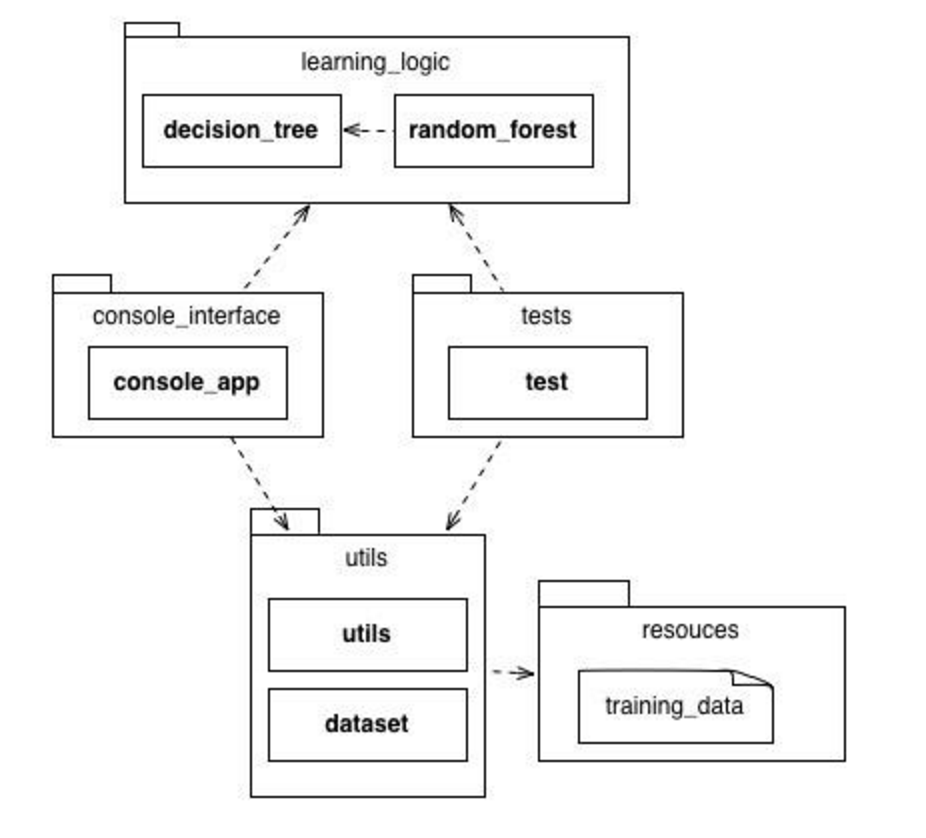

# Random Forests

### Intro

Python package for analysing data using machine learning techniques.
The package provides implementation of different kinds of decision trees and random forests in order to solve classification problems and handle different datasets.

As the creation of a random forest can be a demanding job, different implementations are provided for parallel and sequential processing.

It should be noted that the base methodology to build decision trees we use is called CART ( [Classification and regression trees](https://www.stat.berkeley.edu/~breiman/papers.html), developed by Leo Breiman. CART uses a recursive partitioning method for building decision trees for classification and regression.

The library was developed relying only on modules included in a standard installation of Python 3.5, so as to maintain the most uncoupled and portable implementation possible.

To make the implementation generic to any dataset, a normalization function which deletes dataset incomplete entries of the same was implemented. Similarly in the "dataset.py " module various functions of analysis and manipulation of the dataset are implemented.

### Creating a decision tree

The default method for creating a decision tree has no stop condition, which results in a perfectly fitting tree for the training set. Since probably the training set has a large number of records, this algorithm may cause overfitting.

For this reason we take as stop condition the maximum number of records to have in each leaf. Another way to stop the construction of the tree was restricting the height of the tree under construction.

###### Stop conditions

We rely on two stopping rules for building decision trees:

1. **Maximum tree height:** parameters Receive the maximum height of the tree to be built and when it reaches that point, the nodes belonging to that level are transformed into leaves.

2. **Number of items by node:** Receive parameters the minimum number of items within the node. The algorithm iterates and constructs the tree until the number of items having a node is minor (if it iterates again, the number of items is less than the minimum established) or equal to preset minimum.

For each stoping condition, a different algorithm for creating the tree is implemented, this can be found in the "decision_tree.py" module.

### Concurrent construction techniques for the forest

To create the random forest, a separate module ("random_forest.py") provides different implementations of the forest. This module has the responsibility to create the forest and evaluation of it.

To build the forest and to evaluate the test, concurrent and sequential implementations are provided in the module in order to increase performance.

### Parallelization

Depending on the application, two common approaches in parallel programming are running code in multiple threads or processes. The difference is that the threads usually have access to the same memory areas, so this approach can easily lead to synchronization errors.

Multiple parallel processes are a safer approach as separate segments handle different memory areas that run independently from each other.

To achieve this we use the multiprocessing module python way to make better use of processor capacity.

The techniques used by the multiprocessing module where output Queue and process pool, the performance of both were virtually identical.

### Architecture

 

#### Project modules:
* ***Decision_tree:*** Contains all logic for creating a decision tree with different stop conditions, classification algorithms and printing trees.

* ***Random_forest:*** Creation and classification algorithms for a forest. Decision algorithms are implemented both sequentially and concurrently in order to improve the performance of heavy operations such as creating multiple decision trees.

* ***Dataset:*** Functions to edit, handle and import as a .csv file into an array of data.

* ***Utils:*** Utilities for calculating significant attributes of a dataset.

* ***Tests:*** Implementation of tests to measure performance of different algorithms and evaluate a dataset.

* ***Console_app:*** Console Application shows a test run of the program.
